Étudiant en troisième année de BUT Informatique (parcours Réalisation d'applications) à l'IUT de Montreuil, en apprentissage comme développeur. Major de promo en S3 et S4. Je vise ensuite un cycle ingénieur en ingénierie logicielle.

J'aime les projets où il faut réfléchir à l'architecture avant d'écrire la première ligne, et les outils qui font gagner du temps aux gens autour de moi.

### En ce moment

- **Agôn Cup** — plateforme de tournois de jeux compétitifs, en binôme (React, Flask, PostgreSQL, temps réel)
- **Portfolio v2** — refonte complète de mon site en Next.js
- Automatisation de traitements de données en Python dans le cadre de mon alternance

### Projets

| Projet | Description | Stack |
| :-- | :-- | :-- |
| **Agôn Cup** | Tournois, équipes, arbre et chat en direct | React · TypeScript · Flask · PostgreSQL |
| **MusicoLab** | Évaluation de la justesse vocale (SAE S4) | Python |
| **Bloggy** | Application de blog CRUD | Node · Express · MongoDB |
| **TRESI / GANTT** | Suivi de présence d'une équipe | Python |
| **Portfolio v2** | Mon site personnel | Next.js · Tailwind · Framer Motion |

### Outils

### Activité

<picture>
  <source media="(prefers-color-scheme: dark)" srcset="https://raw.githubusercontent.com/TON_PSEUDO/TON_PSEUDO/output/pacman-contribution-graph-dark.svg">
  
</picture>

### Contact

[fabioguerreiromarques.fr](https://www.fabioguerreiromarques.fr) · [LinkedIn](https://www.linkedin.com/in/TON_SLUG_LINKEDIN)
